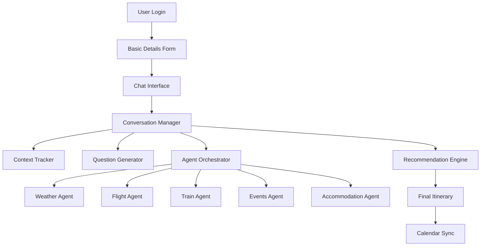

# 🤖 Conversational Travel Planning System

## 🏗️ Architecture Overview



## 🗣️ Conversation Flow Design

### Phase 1: Basic Information Collection
```json
{
  "initial_form": {
    "city": "Paris, France",
    "month": "June 2025",
    "duration": 7,
    "travelers": 2,
    "traveler_types": ["adult", "adult"],
    "budget": 3000,
    "currency": "USD"
  }
}
```

### Phase 2: Conversational Refinement
```
🤖: "Great! A 7-day trip to Paris in June for 2 adults with a $3000 budget. Let me help you plan the perfect itinerary!"

🤖: "First, what brings you to Paris? Are you interested in:"
   - 🎨 Art & Culture (Museums, Galleries)
   - 🍷 Food & Wine Experiences  
   - 🏰 Historical Sites & Architecture
   - 🛍️ Shopping & Fashion
   - 🌙 Nightlife & Entertainment

👤: "We love art and food!"

🤖: "Perfect! I'm checking the weather for June... ☀️ Great news! June is ideal with 20-25°C temperatures and minimal rain."

🤖: "For flights, I found some options. When would you prefer to travel?"
   - Early June (cheaper flights, fewer crowds)
   - Mid June (perfect weather, moderate prices)  
   - Late June (peak season, higher prices but great events)

👤: "Mid June sounds good"

🤖: "Excellent! I'm finding accommodation options. What's your preference?"
   - Luxury hotel in central Paris (€200-300/night)
   - Boutique hotel in Marais district (€120-180/night)
   - Apartment rental with kitchen (€80-120/night)

[Conversation continues...]
```

## 🧠 Backend Architecture Components

This conversational approach creates a much more engaging and intelligent travel planning experience! The system can adapt in real-time, provide contextual recommendations, and guide users through a natural planning process. 🚀